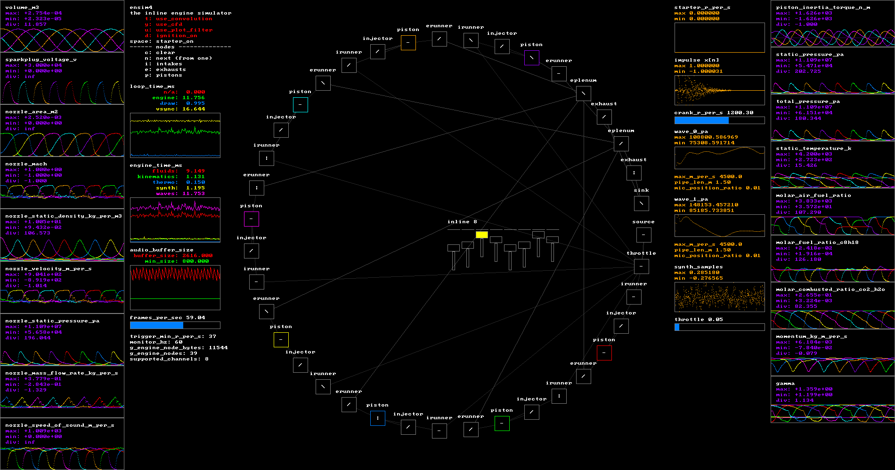

## ENSIM4



`ensim4` is a real-time inline combustion engine test-bed simulator that uses isentropic
flow equations and one dimensional computational fluid dynamics to simulate exhaust gas
pipe dynamics.

`ensim4` generates audio, so crank up your headphones!

For an audio sample:

https://www.youtube.com/watch?v=fq1WPNeVXrI

### BUILD

Requires a C23 compatible compiler.

Dependencies:
```
pacman -S sdl3
```

### TYPICAL USE:

Compile one of either built in engines:

```
make ENGINE=ENGINE_3_CYL
./ensim4
```
or
```
make ENGINE=ENGINE_8_CYL
./ensim4
```

Then, to start your engine:

1. Hold `space` to engage your starter
2. Tap `d` while holding `space` to ignite your spark plugs
3. Manage your throttle with `h, j, k, l`

### CONTROL

Engine nodes (volumes) can be toggled with the cursor.

Otherwise, via the keyboard:
```
    p: Selects all piston nodes
    i: Selects all intake nodes
    e: Selects all exhaust nodes
    c: Clears selection
    n: Selects the next node(s) of the currently (only) selected node
```

The effects of 1D-CFD on audio can be enabled and disabled with the `y` key.

#### OTHER

Performance tuning is done via perf-stat. Logs to `perf.txt`, runs for a number of cycles.
```
make perf
```

#### ATTRIBUTION

Ange Yaghi for inspiration and impulse convolution (https://github.com/ange-yaghi/engine-sim).
